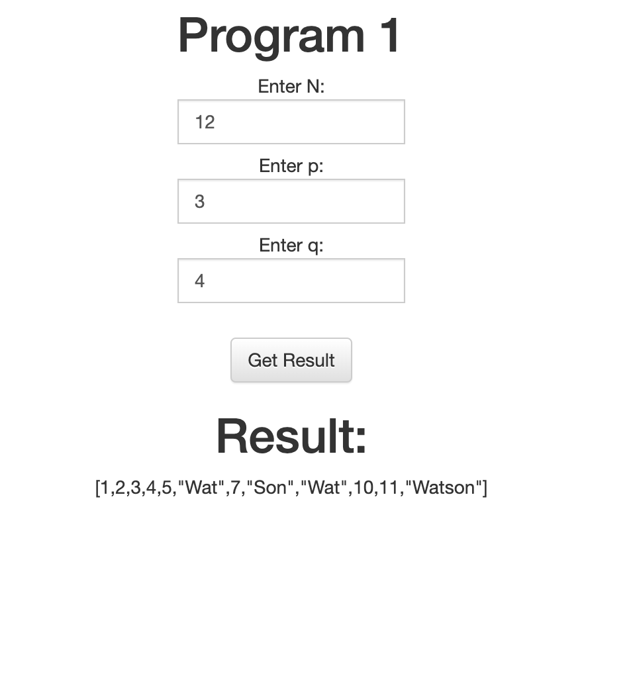

# Program 1
 
The task for project 1 is described as follows:

You are given a positive integer N, and two single-digit integers p and q, where p != q and both are greater than 1. You must output all of the integers from 1 to N inclusive, separated by a single space. However, any integer divisible by p whose decimal representation does not contain the digit p should be replaced by the text WAT and any integer divisible by q whose decimal representation does not contain the digit q should be replaced by the text SON. Integers for which both of the preceding statements are true should instead be replaced by the text WATSON. Write a front end using Angular.js to support the entry of the three numbers and the displaying of the results and a supporting backend preferably using Node.js but you can use any backend you wish. Implement this with the mindset that this will be production level code that will be supported by you and your team mates

### Input

A single line on standard input per testcase: N p q

### Output

The space-separated sequence as described above (only numbers and uppercase chars), with no leading or trailing spaces.
 
### Test 1

*Input*

20 3 4

*Expected Output*

1 2 3 4 5 WAT 7 SON WAT 10 11 WATSON 13 14 WAT SON 17 WAT 19 SON

### Test 2

*Input*

7 2 3

*Expected Output*

1 2 3 WAT 5 WATSON 7

## Setup instructions

Make sure you have node installed on your system. After that, install the node packages.

```
npm install
```

After installing the packages, run

```
npm start
```
You will get the response on `http://localhost:5000`

## Screenshot


