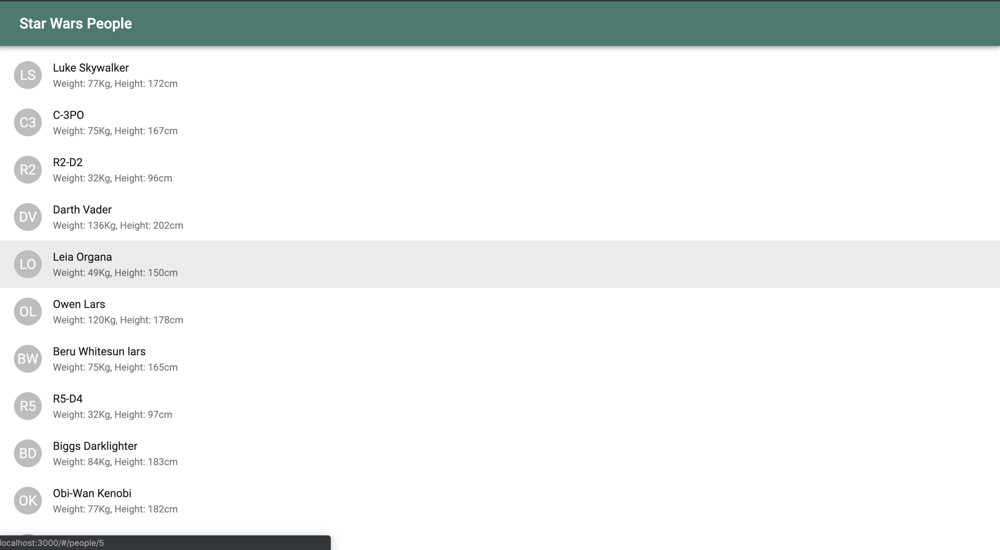
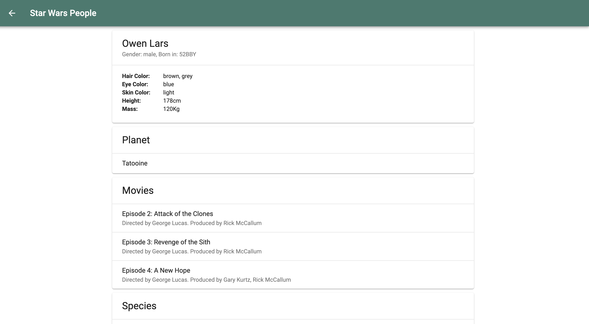

# Program 2

The aim of Program 2 was to: 

By using your favorite JavaScript framework (Angular, React, Vue, SalesForce Lightning*) and standard web technologies (HTML and CSS), generate the following application.

When selecting a character from a dropdown list, display a brief description of the character and a list of the movies where this character appears. Add your name to the dropdown list and display whatever you think should be the output when is an invalid input. Use the SWAPI (use SWAPI https://swapi.co to get the data.
Must have:
*    At least two (2) web components. -- Created multiple components
*    Pass data between components. -- Working fine
*    Character description should be a combination of your own words plus the Character’s data  -- Adding my own data like the initials of each characters. Can add more by creating more cards.
*    Style the list to look like a table. Even and Odd rows should have their own style. -- Used material UI for card like structure
*    The application should be responsive (breaking point – mobile friendly). -- Material UI is mobile friendly
*    Use at least one (1) DOM event. -- Using load more for onClick
*    Use iteration whenever is possible. -- Used at suitable places. For example, to display the people list.

Application is built using React to get info about Star Wars using the SWAPI. Instead of displaying the output in the tabular form, I have used the cards from the Material UI to give a clear distinction between the types with a better layout design.

## Used libraries/technologies

- React JS
- Material UI
- React Router

## Setup instructions

Clone the repository and install the node packages.

```
npm install
```

After installing the packages, run the program using:
```
npm start
```
The program will start at `http://localhost:3000`

## Screenshot 

